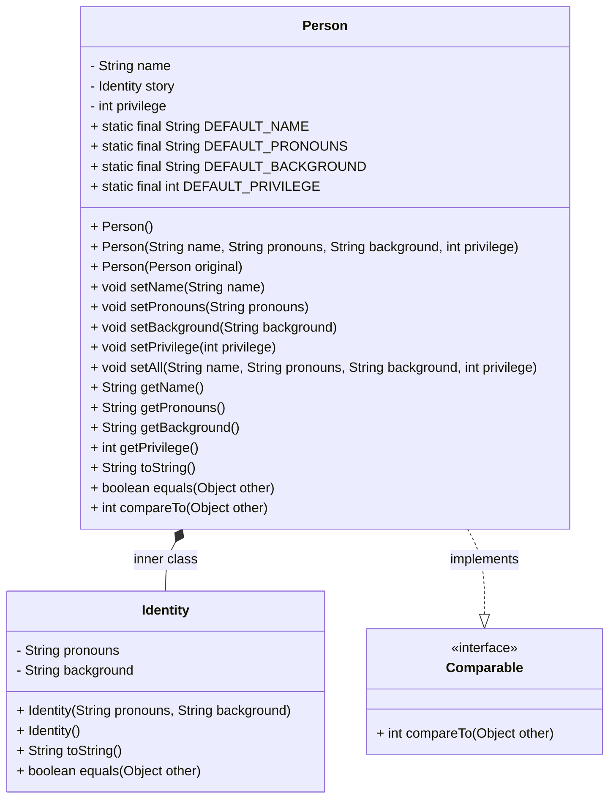

# **Lab 6 - Privilege + Interfaces**
Racism, sexism, ableism, xenophobia, and so many other systems of oppression create environments where it's difficult to have conversations challenging them. A common thread in those discussion is the recognition of one's privilege. From this week's prep, you saw the Privilege Walk activity and how powerful it can be with a group of people.

Although we can't measure the exact privilege an individual has, we can do our best to provide an estimate based off of some statements/questions similar to the Privilege Walk activity. Based off a users answers, the provided program adds/subtracts points to calculate a person's privilege estimate.

Most of the program is complete, but you're asked to complete the project by:

1. adding the `Comparable` interface implementation to the `Person` class, allowing you to also upgrade the driver in `Main` to display a summary of how the users privilege estimate compares to the other 4 preloaded users information (see *Compare with others option* screenshot below for an example of what this could look like).
2. adding the `Identity` inner class to the `Person` class, which contains `pronouns` and `background` instance variables of type `String`. The `story` instance variable in the outer class `Person` should be changed from `String` to `Identity` to use the upgrade.

`TODO:` comments have been placed where appropriate for the above 2 parts, however the changes required to get everything work will extend beyond the `TODO:` markers. For example, changing the `story` instance variable will change the setters, getters, and constructors. It is also suggested (see UML below) that you create individual setters for the Identity instance variables. Full details on what is required for each part of the lab follow after the UML diagram.

UML Diagram below shows what the final structure should look like after the changes above:


## **List of Requirements:**
### Part 1 : Implementing `Comparable`
- `Person.java`:
  - Upgrade class so it implements `Comparable` interface to compare to another `Person` object based on the *natural ordering* of people for this project, based on their privilege estimate
- `Main.java`:
  - Complete option 3 (compare to others) to compare the users info to the all of the others in the provided array
    - Make sure you use the `compareTo` method for the comparison!

### Part 2 : Upgrading to `Identity` Inner class
- `Person.java`:
  - Add the `Identity` inner class as designed in the UML diagram above
  - Change the `story` instance variable to `Identity` type
    - Make sure to update all the methods in `Person` to reflect the change, see UML diagram above for guidance
	- Methods, like `equals`, will also need changes within their method bodies. Make sure to go through each method that uses `story` and change appropriately
- `Main.java`:
  - Update the `fillInfo` method to take in the additional `Identity` data needed
	- Provide examples of [preferred pronouns](https://miracosta.edu/student-services/student-equity/lgbtqia/_docs/GenderPronounsMCCBrandedBW.pdf) for the user (see sample screenshots below)
	- Make sure to call the new setter methods in `Person`


## **Sample Working Screenshots:**
*Note that your output may differ from the examples shown below, as long as it fulfills the requirements above and the output is clean you have creative liberty on how you provide feedback to the user.*

Welcome/Intro:
```
This is a small exercise that gives us a glimpse at how fortunate we have been in life.

What is your name? 
Raul

What are your perfered pronouns? 
he/him/his

Hello Raul, write a small self-identifying statement about yourself and your background and identity!
Tell us about yourself: 
I am a Chicano born and raised in Tijuana/San Diego and a chils of immigrants.
```

Main Menu:
```
~~~Main Menu~~~

1. Take questionnaire to calculate privilege estimate.
2. Check my estimate. (Defaults to 100 if questionnaire has not been taken.)
3. Compare my estimate with others'.
4. Exit program.
What would you like to do?
Enter choice:
```

Privilege Questionnaire option (first two questions as example):
```
Please indicate whether the following statements are true or false.
Input 1 or 2 accordingly.
English is my native language.
1. True. 
2. False.
Enter the appropriate answer: 1

My parents graduated college.
1. True. 
2. False.
Enter the appropriate answer: 2
```

Privilege Questionnaire option (results only):
```
Your privelege estimate is: 110.
Returning to Main Menu...
```

Check my estimate option:
```
~~~Main Menu~~~

1. Take questionnaire to calculate privilege estimate.
2. Check my estimate. (Defaults to 100 if questionnaire has not been taken.)
3. Compare my estimate with others'.
4. Exit program.
What would you like to do?
Enter choice: 2

My name is Raul and my pronouns are he/him/his | I am a Chicano born and raised in Tijuana/San Diego and a chils of immigrants.
According to this calculator I ended up with 100 estimated privilege points
```

Compare with others option:
```
~~~Main Menu~~~

1. Take questionnaire to calculate privilege estimate.
2. Check my estimate. (Defaults to 100 if questionnaire has not been taken.)
3. Compare my estimate with others'.
4. Exit program.
What would you like to do?
Enter choice: 3

More privelege than Amira
More privilage than D'Andra
Less privelege than Jennifer
Less Privelege than Pete 
Returning to main menu.
```

Exit program option:
```
~~~Main Menu~~~

1. Take questionnaire to calculate privilege estimate.
2. Check my estimate. (Defaults to 100 if questionnaire has not been taken.)
3. Compare my estimate with others'.
4. Exit program.
What would you like to do?
Enter choice: 4
Exiting program...
```

## **Hacker Challenge**
Remember the Privilege Walk video/activity? Try to simulate that visual, it may not capture the experience of doing the activity in person but we can try to visualize the final results at least! Here's an example of what that could look like:
```
~~~Main Menu~~~

1. Take questionnaire to calculate privilege estimate.
2. Check my estimate. (Defaults to 100 if questionnaire has not been taken.)
3. Compare my estimate with others'.
4. Exit program.
What would you like to do?
Enter choice: 3

			-80    0                     280
			--------------------------------
Name (ESTIMATE):	|      |                       |
Amira (40)		           A
D'Andra (-20)		     D
Jennifer (140)		                    J
Pete (200)                                       P
Raul (110)		                  R

More privelege than Amira
More privilage than D'Andra
Less privelege than Jennifer
Less Privelege than Pete 
Returning to main menu.
```

Another challenge? You got it! Take a look at the axis of privilege diagram (top of this README file) and add more questions to get plenty of coverage for every line in the diagram. Be thoughtful with your wording so it fits the Yes/No format of answering the questions. The Privilege Walk video may come in handy here! 

Want one last challenge? Phew you're on a roll! Add more values to `Identity` (i.e., gender expression, race/ethnicity, nationality, sexuality, etc.). Be thoughtful and intentional in the data collected, as well as how you ask for it. There should be ways to opt out of certain questions if a user doesn't feel comfortable answering certain questions.

